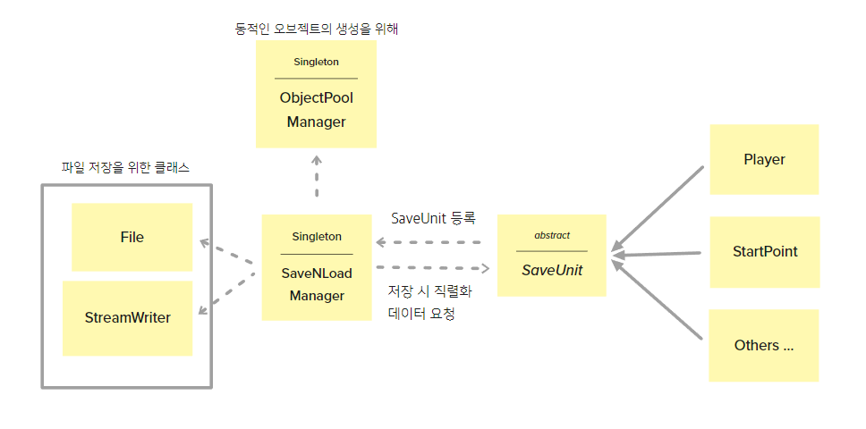
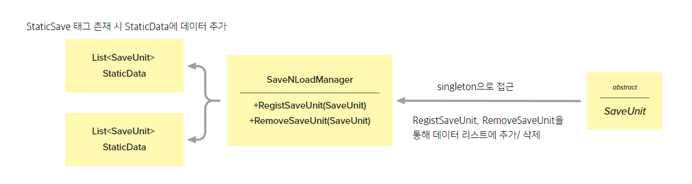
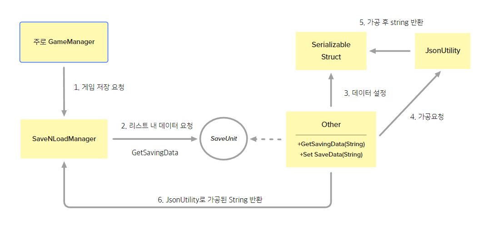
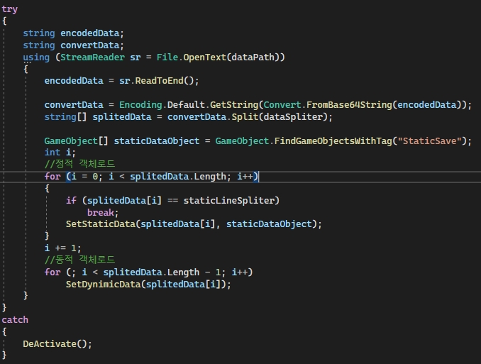

# 3D Jump Game 저장 시스템

## 개요
- 저장 시스템에 대한 간단한 설명입니다.
  
## 저장 시스템 구현 모식도

- 저장 시스템은 크게 singleton으로 구현된 SaveNLoadManager와 단위 클래스 SaveUnit 두 개의 클래스로 이루어져 있습니다. 
- SaveUnit 클래스와 SaveNLoadManager는 발행 구독 패턴의 아이디어를 가지고 재 구성되었습니다. 
- 따라서 새로운 종류의 저장데이터의 추가가 SaveNLoadManager에 영향을 주지 않습니다.
- 새로운 데이터 저장은 SaveUnit을 상속하는 클래스를 제작 시 가능합니다.

## 저장데이터 등록방법
1. SaveUnit을 상속
2. SaveUnit의 GetSavingData, SetSaveData를 overriding

## SaveUnit의 데이터 등록 방법

- 데이터를 SaveNLoadManager에 등록합니다
- SaveUnit은 활성화 여부에 따라 SaveNLoadManager에 자동으로 추가/삭제 됩니다. 
- SaveNLoadManager는 등록 요청이 발생할 때 마다 list에 SaveUnit을 등록합니다. 이때 StaticData/DynimicData로 구분하여 추가합니다.

## 데이터의 구분
- 데이터 구분의 이유
  - 로드 시의 행위의 차이로 두 데이터를 구분지어 저장합니다
  - 존재하는 오브젝트(StaticData) : 맵에서 해당 오브젝트를 찾습니다.(이때 태그를 이용해 문자열 검색량을 줄임)
  - 생성이 필요한 오브젝트(DynamicData) : ObjectPoolManager를 이용해 스폰을 해야합니다.
- 구현의 편의성을 위해 두개의 List로 분리하여 구현했습니다.

## Save과정

  
## 발생 이슈
### 저장데이터의 구조 노출
- Json데이터로 그대로 저장되어 데이터구조가 노출
- 해결과정 :
  - 데이터 암호화는 저장 루틴 시간에 영향이 있을 것으로 생각되고, 또 암호 해석에 능한 사람이라면 쉽게 풀어버릴 것으로 생각하였습니다
  - 복잡한 암호화를 제외하고, 번거롭게하는 작업을 추가하는 것이 좋다고 판단하였습니다
  - 웹 링크를 주고 받을 때, 변수 부분이 글자 포멧차이로 안 읽히는 현상을 아이디어로 인코딩 작업을 추가하기로 하였습니다.
  - Convert 클래스를 이용 base64 인코딩 후 저장하였습니다.

<table>
<tr>
  <td>암호화 전</td>
  <td>암호화 후</td>
</tr>
<tr>
  <td><image src="../../Image/beforeEncode.png"/></td>
  <td><image src="../../Image/afterEncode.png"/></td>
</tr>
</table>

### 프레임 저하 현상
- 원인은 긴 시간이 소요되는 데이터 저장 로직이었습니다.
- 저장 로직을 단순화하기엔 데이터의 직접적인 노출로 제외하였고, 쓰기작업을 비동기화 하면 어떨까라는 생각에 관련 클래스를 탐색하였습니다.
- StreamWrite 내 WriteAsync 함수를 이용, 쓰기 작업을 비동기화하여 프레임저하 및 멈춤현상 해결하였습니다.

 <table>
<tr>
  <td>최적화 전</td>
  <td>최적화 후</td>
</tr>
<tr>
  <td><image src="../../Image/beforeOptimization.png"/></td>
  <td><image src="../../Image/AfterOptimization.png"/></td>
</tr>
</table> 

## 예외처리사항
- Load시 파일이 없는 경우
  - Using의 기능 중 if의 기능이 있어 파일을 불러올수 없을 경우 내부의 코드를 실행하지 않습니다.

- Load시 파일데이터가 이상한경우
  - Load 전과정 중 하나의 오류라도 발생할 경우 데이터 로드를 중단하고 새로 시작하는 것으로 결정하였습니다.
  - DeActivate()는 앞서 로드되던 object의 데이터를 초기화하고, 등록된 저장데이터 List의 내용물을 Remove(해제) 해줍니다

## 예외처리를 포함한 저장로직 코드
;

## 코드의 파일
- [SaveNLoadManager](./Code/SaveNLoadManager.cs)
- [SaveUnit](./Code/SaveUnit.cs)
- 코드의 자세한 내용을 보고 싶으시다면 위 링크를 눌러주시면 됩니다.

<!---

 구현했던 코드 중 하나인 저장시스템에 대해서 설명드리겠습니다.

저장이 필요한 객체는 SaveUnit를 상속하고, 맵에 Spawn되어 있는 객체라면 StaticSave 태그를 추가해야 합니다. 또한 SaveUnit의 추상 메소드를 구현해주어야 저장 객체로 사용할 수 있습니다. 직렬화된 데이터는 여러가지 포멧을 사용할 수 있지만 이 프로젝트에서는 JsonUtility라이브러리를 사용하였고, 이를 통해 직렬화 가능한 구조체 한 개의 추가로 데이터를 쉽게 인코딩/디코딩 할 수 있습니다, 또 꼭 필요한 데이터만을 선택적으로 저장이 가능합니다.

 저장 시스템을 개발하면서 생긴 이슈는 2가지가 있습니다. 저장데이터의 구조 노출과 데이터 포멧 변경 과정의 비용으로 인한 프레임저하 및 멈춤현상입니다. 저장데이터 구조 노출 이슈의 경우, 암호화로 인한 프레임저하 우려로 base64 인코딩으로 최소한의 안전장치를 추가하였고, 저장 로직으로 인해 생긴 프레임저하 현상은 비동기 쓰기로 해결하였습니다. 

 내용의 초과로 모두 작성할 수 없던 점 양해 부탁드립니다. 제가 작성한 포트폴리오를 직접 보시면 추가적이 내용과 더 쉽고 자세한 내용으로 보실 수 있습니다. 감사합니다.

 위 내용은 스마일게이트 내 포폴 설명에 적힌 내용입니다. 참고하기 위해 주석으로 포함하였습니다.
 --->